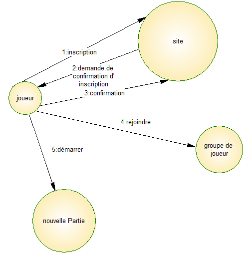
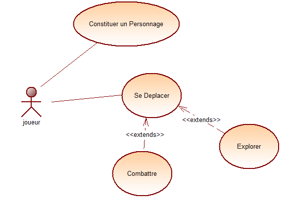
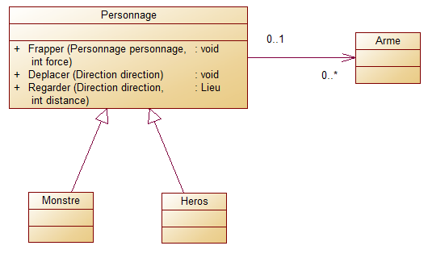
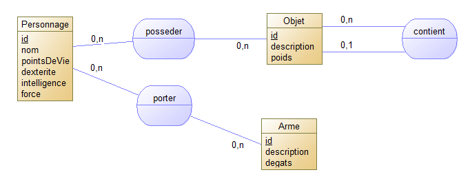

# PROJET SIO CRAWLER #
## Présentation du projet : ##

le but est de réaliser un jeu de rôle permettant un jeu peu massivement multi joueur permettant aux étudiants du bts sio de se divertir pendant les heures de cantine mais surtout d'améliorer leurs compétences en développement.

Les outils mis en oeuvre :

* GIT
* VISUAL STUDIO
* MY SQL
* APACHE

le développement tourne autour de 3 grandes parties :

1. Inscription en ligne.
2. Développement du jeu en lui même permettant l'exploration d'un labyrinthe.
3. La sauvegarde des personnages et du contexte du jeu.

| développement            |      Languages      |  Technique de programmation                           |
|------------------------- |:-------------------|:-----------------------------------------------------|
| Inscription en ligne     | PHP, MySql          | Developpement WEB MVC avec Code Igniter               |
| SIO Crawler le jeu       | C#                  | programmation objet, tests unitaires                  |
| Sauvegarde du contexte   | C#, MySql           | programmation procédurale procédures stockées en mysql|

## L'inscription en Ligne ##

site web permettant à un joueur de s'inscrire en ligne le projet prévoit le principe suivant pour l'inscription en ligne.

## SIO Crawler le jeu ##

Le joueur possédera les fonctionnalités suivantes

### Les classes développées ###

## Sauvegarde du Contexte ##

